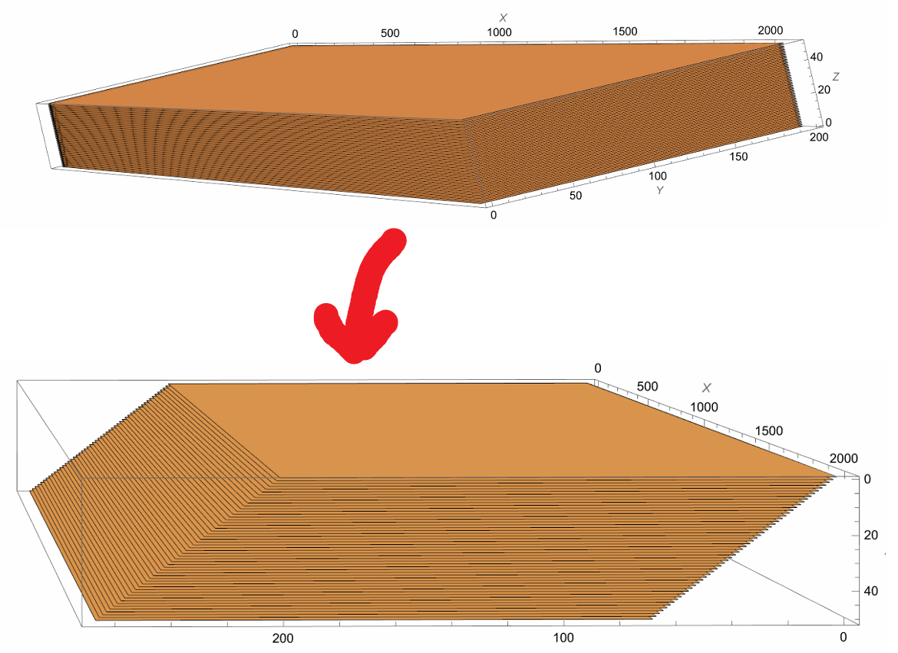
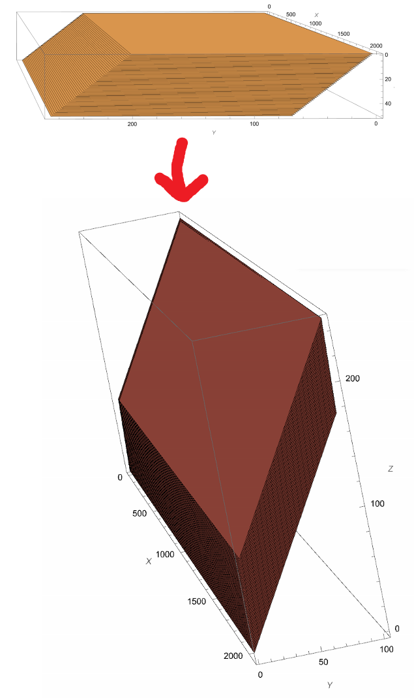

# usage

## Synopsis

The help text of warpaffine is given below. This can be printed by running `warpaffine --help`.

```
Deskew-processing
Usage: warpaffine.exe [OPTIONS]

  version: 0.1.0

Options:
  -h,--help         Print this help message and exit

  -s,--source SOURCE_FILE
                    The source CZI-file to be processed.

  -d,--destination DESTINATION_FILE
                    The destination CZI-file to be written. If "nul" is
                    specified here, then the processed data is not written out,
                    it is discarded instead.

  -o,--operation MODE_OF_OPERATION
                    Specifies the mode of operation. Possible values are
                    'Deskew', 'CoverGlassTransform',
                    'CoverGlassTransform_and_xy_rotated' and 'Identify'.

  -i,--interpolation INTERPOLATION
                    Specifies the interpolation mode to be used. Possible values
                    are 'NN' or 'NearestNeighbor', 'linear', 'cubic', 'bspline',
                    'catmullrom' and 'b05c03'.

  -r,--reader READER_IMPLEMENTATION
                    Which libCZI-reader-implementation to use. Possible values
                    are 'stock' and (on Windows) 'mmf'.

  -t,--number_of_reader_threads NUMBER_OF_READER_THREADS
                    The number of reader-threads.

  -b,--bricksource BRICK_READER_IMPLEMENTATION
                    Which brick-reader-implementation to use. Possible values
                    are 'planereader', 'planereader2' or 'linearreading'.

  -w,--warp_engine WARP_ENGINE_IMPLEMENTATION
                    Which warp-affine transformation implementation to use.
                    Possible values are 'IPP', 'reference' or 'null'.

  --stop_pipeline_after STOP_AFTER_OPERATION
                    For testing: stop the pipeline after operation. Possible
                    values are 'read', 'decompress' or 'none'.

  --task_arena_implementation TASK_ARENA_IMPLEMENTATION
                    For testing: choose the task-arena implementation.
                    Currently, there is only one available: 'tbb'.

  -c,--compression_options COMPRESSION_OPTIONS
                    Specify compression parameters.

  --parameters_bricksource TEXT
                    Specify parameters for the brick-reader

  --verbosity VERBOSITY
                    Specify the verbosity for messages from the application.
                    Possible values are 'maximal' (3), 'chatty' (2), 'normal'
                    (1) or 'minimal' (0).

  --hash-result     Calculate a hash for the result data.

  -m,--max-tile-extent MAX_TILE_EXTENT
                    Specify the max width/height of a tile. If larger, the tile
                    is split into smaller tiles. Default is 2048.

  --override-memory-size RAM-SIZE
                    Override the main-memory size.

  --override-check-for-skewed-source
                    Override check of source-document whether it is marked as
                    containing 'skewed z-stacks'.


libCZI version: 0.50.0
TBB version: 2021.9.0
IPP version: 2021.8 (r0xba45569b) -  ippIP AVX-512F/CD/BW/DQ/VL (k0)
```

## Explanation of the parameters

* The following options are mandatory and must be given on the command line:
  * `-s,--source SOURCE_FILE`
  * `-d,--destination DESTINATION_FILE`  

  The filenames must be given including the file-extension (usually `.czi`). For the destination file, there is a special value `nul` which instructs to discard the processed data. 
  This is useful for testing.

* The argument `-o,--operation MODE_OF_OPERATION` specifies the transformation which is to be applied to the source document.
  The following values are possible:
  * **Identify**: The identity transformation, which is a dummy operation which does not change the data. Useful for testing.
  * **Deskew**: a shearing transformation is applied. The operation is depicted here:
    
  * **CoverGlassTransform**: the shearing transformation is followed by a rotation around the x-axis so that the stack lines up with the X-Z-plane.
    So, the result of Deskew is then further transformed by a rotation around the x-axis, as depicted here:
    
  * **CoverGlassTransform_and_xy_rotated**: the transformation (of CoverGlassTransform) is followed by a rotation aound the z-axis (by 90°).
  
  Conceptually, the input document is transformed as described here, and the resulting volumetric dataset is then sampled in a Cartesian coordinate system.
* The argument `-i,--interpolation INTERPOLATION` instructs which interpolation is to be used (when resampling the transformed volume). Note that
   not all interpolation methods are available for all warp-engines. 
* With the argument `-r,--reader READER_IMPLEMENTATION` different implementations of [libCZI::IStream](https://zeiss.github.io/libczi/classlib_c_z_i_1_1_i_stream.html) interface can be chosen. This component
  is responsible for actually reading the data from the file. There is an experimental implementation leveraging [memory-mapped files](https://learn.microsoft.com/en-us/dotnet/standard/io/memory-mapped-files) (on Windows only).
* `-b,--bricksource BRICK_READER_IMPLEMENTATION` allows to chose between different implementations of the [ICziBrickReader](../libwarpaffine/brickreader/IBrickReader.h)-interface.
  The most stable implementation is `planereader2`, and it is therefore the recommended one (and it is the default).
* `-t,--number_of_reader_threads NUMBER_OF_READER_THREADS` is used to give a parameter to the brick-reader - the number of threads which are used to read the data. '1' is the default value, and it is found that it has little impact on performance in general.
* Different implementation of the warp-affine transformation can be chosen with the argument `-w,--warp_engine WARP_ENGINE_IMPLEMENTATION`. The IPP-based
  implementation is only available if the application is compiled with the IPP library. The reference implementation is always available.
* The option `--stop_pipeline_after STOP_AFTER_OPERATION` is intended to be used for testing/benchmarking, and allows to discard the data at certain points in the pipeline.
* With the option `-c,--compression_options COMPRESSION_OPTIONS` the zstd-compression parameters (for the output file) can be specified. The syntax is as described [here](https://zeiss.github.io/libczi/classlib_c_z_i_1_1_utils.html#a4cb9b660d182e59a218f58d42bd04025).
  The default (if this option is not given) is `zstd1:ExplicitLevel=1;PreProcess=HiLoByteUnpack`.
* The flag `--hash-result` instructs to calculate a hash for the result data. This hash is then printed to the console when the operation has completed.
  Technically,  a MD5-hash is calculated for the (result) image data **and** for the respective plane-coordinates of the subblocks. The individual hashes are then combined in
  a way that the result is independent of the order in which the subblocks are processed. So, the same hash guarantees that the resulting document has the same image content.
* The application checks the size of machines main-memory and tries to adjust to the available RAM. With the option `--override-memory-size RAM-SIZE` a specific value can be
  given instead, and the applicattion will adapt its behavior accordingly. The size can be given with a suffix (e.g. `--override-memory-size 2G`).
* The argument `--verbosity` can be used to control how much output the application is writing to `stdout`. With the value `normal` information about the document and the operation is written out
  before operation begins, and during operation statistics about the on-going operation is shown. This statistics is only printed if `stdout`is a terminal, if it is re-directed to a e.g. file, it is
  not printed. With the value `minimal` there will be no informational text, the only output is then progress information (lines with the text e.g. '34.4%'). Additional lines will be printed if
  when there is a change in progress.
* The source document is examined whether it is suitable to be processed by the application. If it is not, the application will exit with an error. One of those checks is
  examining the XML-metadata of the document, in order to determine that the document is tagged as containing a skewed z-stack. This check can be
  overwritten with the flag `--override-check-for-skewed-source`.
 
The exit code of the application is 0 (EXIT_SUCCESS) only if it ran to completion without any errors. In case of an error (of any kind) it will be <>0.  
In case of circumstances which lead to an abnormal termination, information may be written to `stderr` (and this is not controlled by the `--verbosity` argument); output to `stderr` will
occur unconditionally.
 

## Examples

For basic operation, giving the following parameters is recommended:

```
--operation CoverGlassTransform_and_xy_rotated --interpolation Linear
```

For builds where IPP is available, the IPP-based warp-enigne will be selected by default (if it is not explicitly given). If it is not avaible, then the reference implementation is used.

So, a complete commandine for a basic operation could look like this:

```
./warpaffine --source source_document.czi --destination destination_document.czi --interpolation linear --operation CoverGlassTransform 
```

[Here](https://asciinema.org/a/595898) is a screencast of the application in action.


